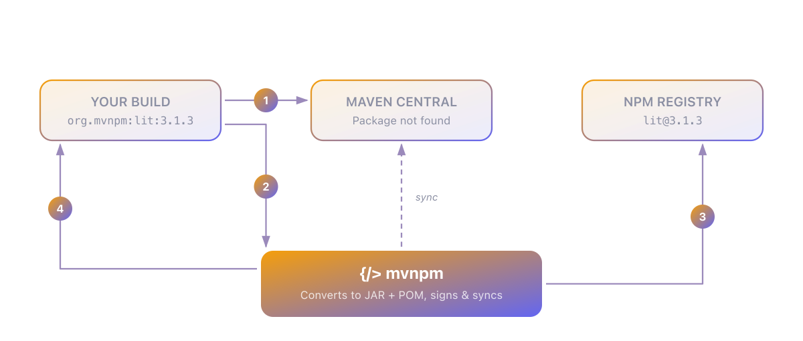

### Use npm like any other Maven dependency...

**mvnpm** (Maven NPM) allows to consume the [NPM Registry](https://www.npmjs.com/) packages as dependencies directly from a Maven or Gradle project:

```xml
    <dependency>
        <groupId>org.mvnpm</groupId>
        <artifactId>{package-name}</artifactId>
        <version>{package-version}</version>
        <scope>{runtime/provided}</scope>
    </dependency>
```

_Use `org.mvnpm.at.{namespace}` as groupId for a particular namespace (i.e. `@hotwired/stimulus` becomes `org.mvnpm.at.hotwired:stimulus`)._

### How to consume?

*   Packaged and served with the [Quarkus Web Bundler extension](https://docs.quarkiverse.io/quarkus-web-bundler/dev/index.html) using scope "provided".
*   Directly Served by Quarkus with scope "runtime"
*   In any Java application with [importmaps](https://github.com/mvnpm/importmap) or [esbuild-java](https://github.com/mvnpm/esbuild-java)
*   In any Java application like you would have done with [webjars](https://www.webjars.org/)

### How to sync a missing package?

A lot of packages are already synced on Central, which mean they can directly be used from you pom.xml or build.gradle. You may check if a package version is available by looking at the "Maven central" badge on the [Browse page](/).  
**If it's not:**

*   Click on the "Maven Central" badge to trigger a sync with Maven Central
*   Configure your local Maven settings to use the [MVNPM Maven Repository as a fallback](#configure-fallback-repo). When a package is missing, it will fetch it from the fallback repository and automatically trigger a sync with Maven Central.

**You should use the Maven Central repository for production builds.**

### How to configure the fallback repository?

The **mvnpm** Maven repository is a facade on top of the [NPM Registry](https://www.npmjs.com/), it is handy when starting (or updating versions) on a project with many non synchronised packages (which will become more and more unlikely in the future).  
to use it in your local Maven settings add the following to your settings.xml (typically /home/your-username/.m2/settings.xml)

```xml
    <settings>
    <profiles>
        <profile>
            <id>mvnpm-repo</id>
            <repositories>
                <repository>
                    <id>central</id>
                    <name>central</name>
                    <url>https://repo.maven.apache.org/maven2</url>
                </repository>
                <repository>
                    <snapshots>
                        <enabled>false</enabled>
                    </snapshots>
                    <id>mvnpm.org</id>
                    <name>mvnpm</name>
                    <url>https://repo.mvnpm.org/maven2</url>
                </repository>
            </repositories>
        </profile>
    </profiles>

    <activeProfiles>
        <activeProfile>mvnpm-repo</activeProfile>
    </activeProfiles>

</settings>
```

### How does the mvnpm Maven repository work ?



*   Developer's Maven build requests an npm package from Maven Central.
*   Maven Central returns a 404 if the package does not exist.
*   The developer's Maven build continues to the next repository (as configured above) and requests the npm package from mvnpm.
*   mvnpm requests the NPM Registry for the package (tgz) and converts it to a JAR. It also generates and includes an import map and pom for this package.
*   mvnpm returns this JAR to the developer, and the developer can continue with the build.
*   In the background, mvnpm kicks off a process to create all the files needed to release this package to Maven Central. This includes:  
    \- source  
    \- javadoc  
    \- signatures for all of the files (sha1, md5, asc)  
    \- bundling all the above to upload to Central.
*   Once the bundle exists, it gets uploaded and released to Maven Central.
*   This means that by the time the CI/CD pipeline of the developer runs, the package is available in Maven Central.

### How to update versions?

**mvnpm** continuously monitor the NPM Registry for any previously synchronized packages. When it detects a new version, a synchronization process will be initiated. So tools like dependabot will be able to propose the new version in your pull requests.

### How to lock dependencies?

**Locking with Maven**

The [mvnpm locker Maven Plugin](https://github.com/mvnpm/locker) will create a version locker profile for your org.mvnpm and org.webjars dependencies. Allowing you to mimick the package-lock.json and yarn.lock files in a Maven world.

It is essential as NPM dependencies are typically deployed using version ranges, without locking your builds will use different versions of dependencies between builds if any of your transitive NPM based dependencies are updated.

In addition when using the locker, the number of files Maven need to download is considerably reduced as it no longer need to check all possible version ranges (better for reproducibility, contributors and CI).

**Locking with Gradle**
Gradle provides a native version locking system, to install it, add this:

build.gradle
```groovy
dependencyLocking {
lockAllConfigurations()
}
```
Then run `gradle dependencies --write-locks` to generate the lockfile.